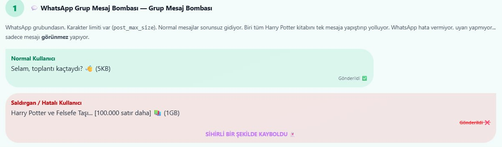
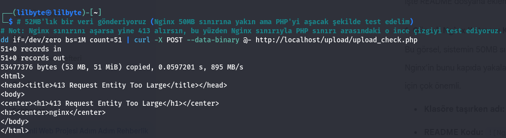
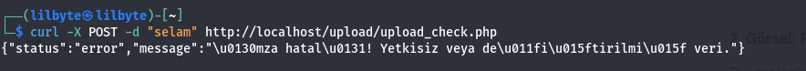

# 🛡️ Secure Web Foundry: POST Data Size & HMAC Protection

## 📌 Proje Hakkında
Bu proje, web sunucularına yönelik DoS (Denial of Service) saldırılarını, bellek taşmalarını ve yetkisiz veri gönderimlerini engellemek amacıyla **Katmanlı Savunma (Layered Defense)** mimarisini uygular.

## 🧠 Felsefe ve Mantık (Neden Bu Proje?)
Web güvenliğinde sadece "kodu yazmak" yetmez. Sunucu konfigürasyonunun da zırhlanması gerekir. Bu projede şu iki temel mantığı işledik:

### 1. Asansör Mantığı (post_max_size vs upload_max_filesize)
Tıpkı bir asansörün 400kg kapasitesi varken 600kg bindiğinde hareket etmemesi ve alarm vermesi gibi, sunucumuz da kapasiteyi aşan veriyi kapıda yakalar. `memory_limit > post_max_size > upload_max_filesize` hiyerarşisi ile sunucunun "asansörü" asla çökmez.


### 2. WhatsApp Mantığı (Sessiz Hata - Silent Failure)
Birisi WhatsApp'tan 2GB dosya göndermeye çalışsa ve sistem hata vermeden sadece dosyayı silse, kullanıcı sistemin bozuk olduğunu sanır. PHP'nin varsayılan huyu budur. Biz yazdığımız **Middleware** ile bu sessizliği bozduk; hata vererek kullanıcıyı ve sistemi koruyoruz.



## 🛠️ Teknik Mimari ve Özellikler

### Katman 1: Sınır Güvenliği (Nginx)
Uç noktalara (Endpoints) özel limitler konulmuştur. Veri PHP'ye ulaşmadan Nginx tarafından durdurulur.
- `/api/`: 2MB limit (Küçük veri)
- `/upload/`: 50MB limit (Dosya)
- `/webhook/`: 512KB limit (Sinyal)


### Katman 2: Kod Güvenliği (PHP Middleware)
Nginx'i geçen veriler, PHP içinde `Content-Length` kontrolüne tabi tutulur ve "Silent Failure" engellenir.

### Katman 3: Kimlik ve Bütünlük Doğrulaması (HMAC)
Sadece boyut yetmez! Dev şirketlerin (Twilio, Meta) standartlarında **HMAC SHA256** imza doğrulaması eklenmiştir. İmzasız veya yolda değiştirilmiş veriler anında reddedilir (HTTP 403).

## 🚀 Kurulum ve Test

1. Nginx ve PHP-FPM konfigürasyonlarını `/configs` klasöründeki gibi yapın.
2. Servisleri restart edin: `sudo systemctl restart nginx php8.4-fpm`.
3. Test etmek için terminalde şu komutu çalıştırın:
    ```bash
    curl -X POST -d "selam" http://localhost/upload/upload_check.php
    ```

## 🚀 Teknik Kanıtlar (PoC)

#### 1. Katman: Nginx Boyut Koruması


#### 2. Katman: PHP & HMAC Doğrulaması

